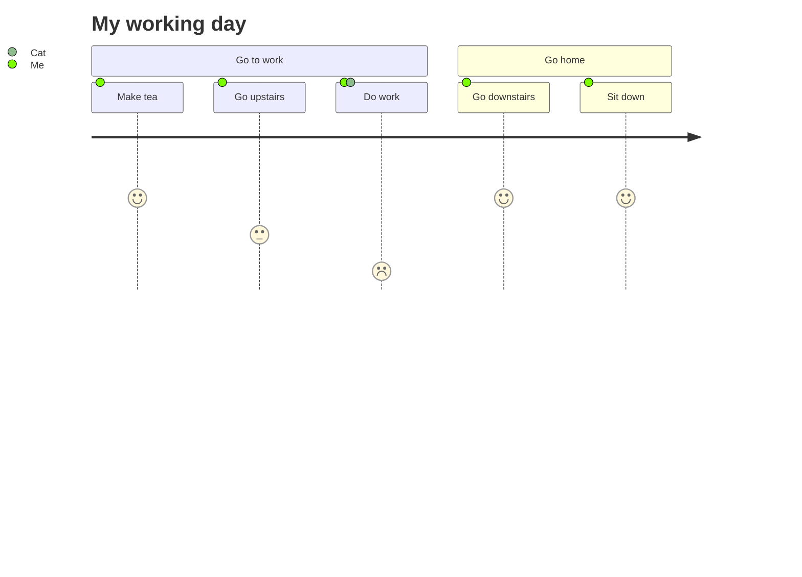

### Course 1



```js
import { defineConfig } from 'vite'
import { svelte } from '@sveltejs/vite-plugin-svelte'
import { readdir, rm, writeFile } from 'fs/promises';
import { getCoursesSlug, getChaptersSlug } from './src/lib/api/content';
// https://vitejs.dev/config/
export default defineConfig({
	root: './web-components',
	build: {
		outDir: '../static/wc',
		rollupOptions: {
			input: './web-components/app.html'
		},
		emptyOutDir: true,
		assetsDir: '',
		// sourcemap: 'inline', // enable for debugging
	},
	server: {
		port: 4200,
	},
	plugins: [
		svelte({

			compilerOptions: {
				customElement: true,
			},
		}),
		syncToHugo()
	]
})

function syncToHugo() {

	return {
		closeBundle: async () => {
			const svelteBuild = './static/wc/';
			const assets = await readdir(svelteBuild);
			const js = assets.filter(name => name.match(/(app.)(?!.*?esm)(?!.*?css).*\w+/))[0];
			const css = assets.filter(name => name.includes('.css'))[0];

			// move ./static/app.html to ./src/routes/app.ts
			await Promise.all([
				writeFile(`./src/lib/data/svelte.ts`, 
				`export const js = "${js}";
export const css = "${css}";`),
			]);
			console.log(`wrote ${js} to hugo data`);

			const routes = getAllPaths();

			// write all routes to array of string.

			await writeFile(`./paths.json`,	JSON.stringify(routes, null, 2)); 
		}
	}
}


export function getAllPaths() {

	const courses = getCoursesSlug();

	const routes = []

	courses.map(course => {
		const chapters = getChaptersSlug(course);
		chapters.map(chapter => {
			// remove md extension.
			chapter = chapter.replace('.md', '');
			routes.push(`/courses/${course}/${chapter}`)
		})
	})
	return routes;
}

```
